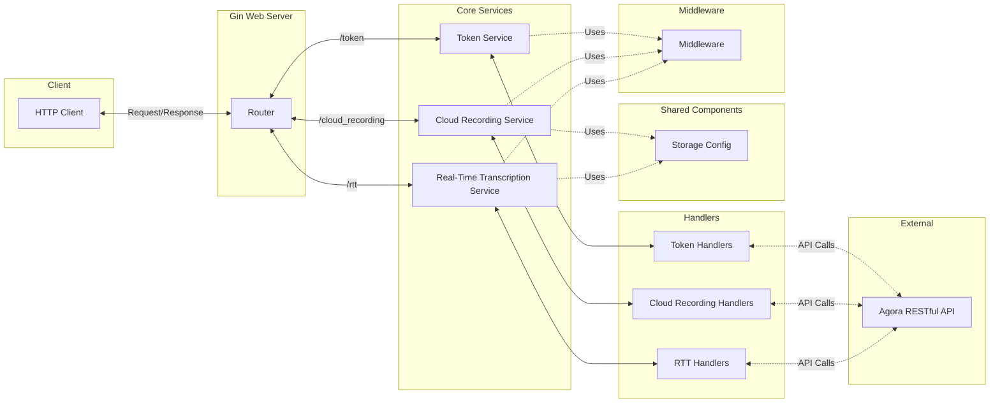
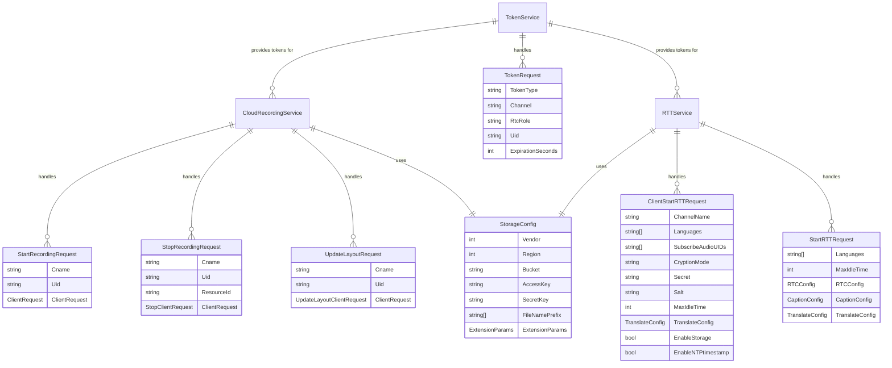
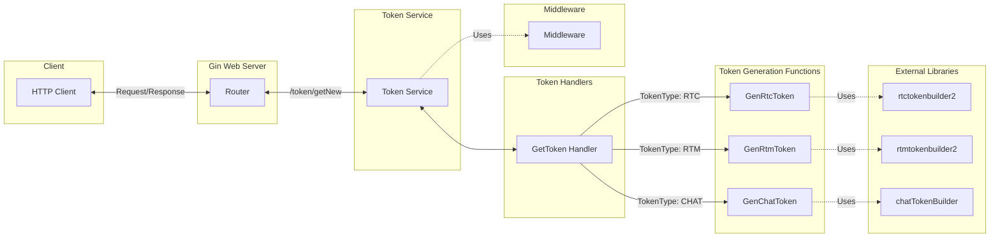
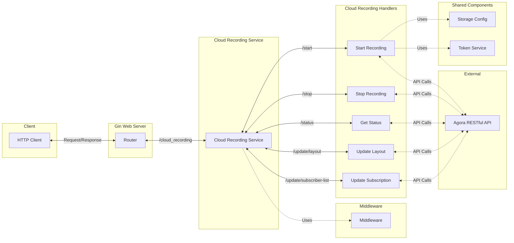

# Architectures

## Overview

```mermaid
flowchart LR
    subgraph Client
        A[HTTP Client]
    end

    subgraph "Gin Web Server"
        B[Router]
    end

    subgraph "Core Services"
        direction TB
        C[Token Service]
        D[Cloud Recording Service]
        E[Real-Time Transcription Service]
    end

    subgraph "Handlers"
        direction TB
        F[Token Handlers]
        G[Cloud Recording Handlers]
        H[RTT Handlers]
    end

    subgraph "Shared Components"
        J[Storage Config]
    end

    subgraph "Middleware"
        I[Middleware]
    end

    subgraph "External"
        K[Agora RESTful API]
    end

    A <-->|Request/Response| B
    B <-->|/token| C
    B <-->|/cloud_recording| D
    B <-->|/rtt| E
    C <--> F
    D <--> G
    E <--> H
    D & E -.->|Uses| J
    C & D & E -.->|Uses| I
    F & G & H <-.->|API Calls| K

    classDef request fill:#f9f,stroke:#333,stroke-width:2px;
    classDef response fill:#bbf,stroke:#333,stroke-width:2px;
```

## Entity Relationship Diagram

```mermaid
erDiagram
    TokenService ||--o{ CloudRecordingService : "provides tokens for"
    TokenService ||--o{ TokenRequest : handles
    TokenService ||--o{ RTTService : "provides tokens for"

    TokenRequest {
        string TokenType
        string Channel
        string RtcRole
        string Uid
        int ExpirationSeconds
    }

    CloudRecordingService ||--o{ StartRecordingRequest : handles
    CloudRecordingService ||--o{ StopRecordingRequest : handles
    CloudRecordingService ||--o{ UpdateLayoutRequest : handles
    CloudRecordingService ||--|| StorageConfig : "uses"
    StartRecordingRequest {
        string Cname
        string Uid
        ClientRequest ClientRequest
    }
    StopRecordingRequest {
        string Cname
        string Uid
        string ResourceId
        StopClientRequest ClientRequest
    }
    UpdateLayoutRequest {
        string Cname
        string Uid
        UpdateLayoutClientRequest ClientRequest
    }

    RTTService ||--o{ ClientStartRTTRequest : handles
    RTTService ||--o{ StartRTTRequest : handles
    RTTService ||--|| StorageConfig : "uses"
    ClientStartRTTRequest {
        string ChannelName
        string[] Languages
        string[] SubscribeAudioUIDs
        string CryptionMode
        string Secret
        string Salt
        int MaxIdleTime
        TranslateConfig TranslateConfig
        bool EnableStorage
        bool EnableNTPtimestamp
    }
    StartRTTRequest {
        string[] Languages
        int MaxIdleTime
        RTCConfig RTCConfig
        CaptionConfig CaptionConfig
        TranslateConfig TranslateConfig
    }

    StorageConfig {
        int Vendor
        int Region
        string Bucket
        string AccessKey
        string SecretKey
        string[] FileNamePrefix
        ExtensionParams ExtensionParams
    }
```

## Token Service

```mermaid
flowchart LR
    subgraph Client
        A[HTTP Client]
    end

    subgraph "Gin Web Server"
        B[Router]
    end

    subgraph "Token Service"
        C[Token Service]
    end

    subgraph "Token Handlers"
        F1[GetToken Handler]
    end

    subgraph "Token Generation Functions"
        G1[GenRtcToken]
        G2[GenRtmToken]
        G3[GenChatToken]
    end

    subgraph "External Libraries"
        E1[rtctokenbuilder2]
        E2[rtmtokenbuilder2]
        E3[chatTokenBuilder]
    end

    subgraph "Middleware"
        I[Middleware]
    end

    A <-->|Request/Response| B
    B <-->|/token/getNew| C
    C <--> F1
    F1 -->|TokenType: RTC | G1
    F1 -->|TokenType: RTM | G2
    F1 -->|TokenType: CHAT | G3
    G1 -.->|Uses| E1
    G2 -.->|Uses| E2
    G3 -.->|Uses| E3
    C -.->|Uses| I

    classDef request fill:#f9f,stroke:#333,stroke-width:2px;
    classDef response fill:#bbf,stroke:#333,stroke-width:2px;
```

## Cloud Recording

```mermaid
flowchart LR
    subgraph Client
        A[HTTP Client]
    end

    subgraph "Gin Web Server"
        B[Router]
    end

    subgraph "Cloud Recording Service"
        D[Cloud Recording Service]
    end

    subgraph "Cloud Recording Handlers"
        G1[Start Recording]
        G2[Stop Recording]
        G3[Get Status]
        G4[Update Layout]
        G5[Update Subscription]
    end

    subgraph "Shared Components"
        J[Storage Config]
        T[Token Service]
    end

    subgraph "Middleware"
        I[Middleware]
    end

    subgraph "External"
        K[Agora RESTful API]
    end

    A <-->|Request/Response| B
    B <-->|/cloud_recording| D
    D <--> |/start| G1
    D <-->|/stop| G2
    D <-->|/status| G3
    D <-->|/update/layout| G4
    D <-->|/update/subscriber-list| G5
    G1 -.->|Uses| J
    G1 -.->|Uses| T
    D -.->|Uses| I
    G1 & G2 & G3 & G4 & G5 <-.->|API Calls| K

    classDef request fill:#f9f,stroke:#333,stroke-width:2px;
    classDef response fill:#bbf,stroke:#333,stroke-width:2px;
```
