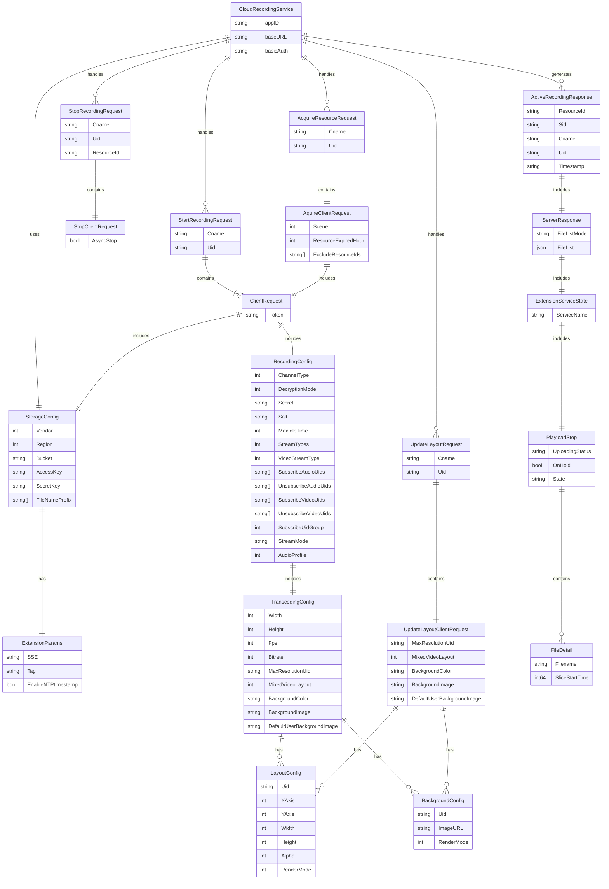

# Cloud Recording Entity Relationship Diagram

```mermaid
erDiagram
    CloudRecordingService ||--o{ StartRecordingRequest : handles
    CloudRecordingService ||--o{ StopRecordingRequest : handles
    CloudRecordingService ||--o{ UpdateLayoutRequest : handles
    CloudRecordingService ||--o{ AcquireResourceRequest : handles
    CloudRecordingService {
        string appID
        string baseURL
        string basicAuth
    }

    CloudRecordingService ||--|| StorageConfig : uses
    StorageConfig {
        int Vendor
        int Region
        string Bucket
        string AccessKey
        string SecretKey
        string[] FileNamePrefix
    }
    StorageConfig ||--|| ExtensionParams : has
    ExtensionParams {
        string SSE
        string Tag
        bool EnableNTPtimestamp
    }

    StartRecordingRequest ||--|{ ClientRequest : contains
    StartRecordingRequest {
        string Cname
        string Uid
    }

    ClientRequest ||--|| StorageConfig : includes
    ClientRequest ||--|| RecordingConfig : includes
    ClientRequest {
        string Token
    }

    RecordingConfig {
        int ChannelType
        int DecryptionMode
        string Secret
        string Salt
        int MaxIdleTime
        int StreamTypes
        int VideoStreamType
        string[] SubscribeAudioUids
        string[] UnsubscribeAudioUids
        string[] SubscribeVideoUids
        string[] UnsubscribeVideoUids
        int SubscribeUidGroup
        string StreamMode
        int AudioProfile
    }

    RecordingConfig ||--|| TranscodingConfig : includes
    TranscodingConfig {
        int Width
        int Height
        int Fps
        int Bitrate
        string MaxResolutionUid
        int MixedVideoLayout
        string BackgroundColor
        string BackgroundImage
        string DefaultUserBackgroundImage
    }

    TranscodingConfig ||--o{ LayoutConfig : has
    LayoutConfig {
        string Uid
        int XAxis
        int YAxis
        int Width
        int Height
        int Alpha
        int RenderMode
    }

    TranscodingConfig ||--o{ BackgroundConfig : has
    BackgroundConfig {
        string Uid
        string ImageURL
        int RenderMode
    }

    StopRecordingRequest {
        string Cname
        string Uid
        string ResourceId
    }
    StopRecordingRequest ||--|| StopClientRequest : contains
    StopClientRequest {
        bool AsyncStop
    }

    UpdateLayoutRequest {
        string Cname
        string Uid
    }
    UpdateLayoutRequest ||--|| UpdateLayoutClientRequest : contains
    UpdateLayoutClientRequest {
        string MaxResolutionUid
        int MixedVideoLayout
        string BackgroundColor
        string BackgroundImage
        string DefaultUserBackgroundImage
    }
    UpdateLayoutClientRequest ||--o{ LayoutConfig : has
    UpdateLayoutClientRequest ||--o{ BackgroundConfig : has

    AcquireResourceRequest {
        string Cname
        string Uid
    }
    AcquireResourceRequest ||--|| AquireClientRequest : contains
    AquireClientRequest {
        int Scene
        int ResourceExpiredHour
        string[] ExcludeResourceIds
    }
    AquireClientRequest ||--|| ClientRequest : includes

    CloudRecordingService ||--o{ ActiveRecordingResponse : generates
    ActiveRecordingResponse {
        string ResourceId
        string Sid
        string Cname
        string Uid
        string Timestamp
    }
    ActiveRecordingResponse ||--|| ServerResponse : includes
    ServerResponse {
        string FileListMode
        json FileList
    }
    ServerResponse ||--|| ExtensionServiceState : includes
    ExtensionServiceState {
        string ServiceName
    }
    ExtensionServiceState ||--|| PlayloadStop : includes
    PlayloadStop {
        string UploadingStatus
        bool OnHold
        string State
    }
    PlayloadStop ||--o{ FileDetail : contains
    FileDetail {
        string Filename
        int64 SliceStartTime
    }

```
