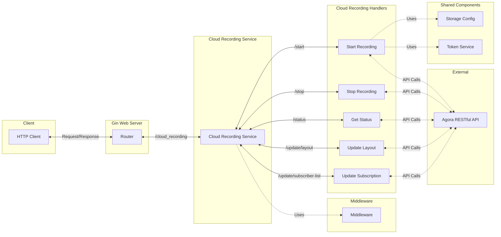

# Cloud Recording Flow Diagram

```mermaid
flowchart LR
    subgraph Client
        A[HTTP Client]
    end

    subgraph "Gin Web Server"
        B[Router]
    end

    subgraph "Cloud Recording Service"
        D[Cloud Recording Service]
    end

    subgraph "Cloud Recording Handlers"
        G1[Start Recording]
        G2[Stop Recording]
        G3[Get Status]
        G4[Update Layout]
        G5[Update Subscription]
    end

    subgraph "Shared Components"
        J[Storage Config]
        T[Token Service]
    end

    subgraph "Middleware"
        I[Middleware]
    end

    subgraph "External"
        K[Agora RESTful API]
    end

    A <-->|Request/Response| B
    B <-->|/cloud_recording| D
    D <--> |/start| G1
    D <-->|/stop| G2
    D <-->|/status| G3
    D <-->|/update/layout| G4
    D <-->|/update/subscriber-list| G5
    G1 -.->|Uses| J
    G1 -.->|Uses| T
    D -.->|Uses| I
    G1 & G2 & G3 & G4 & G5 <-.->|API Calls| K

    classDef request fill:#f9f,stroke:#333,stroke-width:2px;
    classDef response fill:#bbf,stroke:#333,stroke-width:2px;
```
