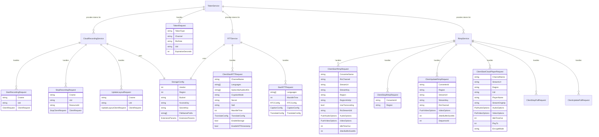

# Overview Entity Relationship Diagram

```mermaid
erDiagram
    TokenService ||--o{ CloudRecordingService : "provides tokens for"
    TokenService ||--o{ TokenRequest : handles
    TokenService ||--o{ RTTService : "provides tokens for"
    TokenService ||--o{ RtmpService : "provides tokens for"

    TokenRequest {
        string TokenType
        string Channel
        string RtcRole
        string Uid
        int ExpirationSeconds
    }

    CloudRecordingService ||--o{ StartRecordingRequest : handles
    CloudRecordingService ||--o{ StopRecordingRequest : handles
    CloudRecordingService ||--o{ UpdateLayoutRequest : handles
    CloudRecordingService ||--|| StorageConfig : "uses"
    StartRecordingRequest {
        string Cname
        string Uid
        ClientRequest ClientRequest
    }
    StopRecordingRequest {
        string Cname
        string Uid
        string ResourceId
        StopClientRequest ClientRequest
    }
    UpdateLayoutRequest {
        string Cname
        string Uid
        UpdateLayoutClientRequest ClientRequest
    }

    RTTService ||--o{ ClientStartRTTRequest : handles
    RTTService ||--o{ StartRTTRequest : handles
    RTTService ||--|| StorageConfig : "uses"
    ClientStartRTTRequest {
        string ChannelName
        string[] Languages
        string[] SubscribeAudioUIDs
        string CryptionMode
        string Secret
        string Salt
        int MaxIdleTime
        TranslateConfig TranslateConfig
        bool EnableStorage
        bool EnableNTPtimestamp
    }
    StartRTTRequest {
        string[] Languages
        int MaxIdleTime
        RTCConfig RTCConfig
        CaptionConfig CaptionConfig
        TranslateConfig TranslateConfig
    }

    RtmpService ||--o{ ClientStartRtmpRequest : handles
    RtmpService ||--o{ ClientStopRtmpRequest : handles
    RtmpService ||--o{ ClientUpdateRtmpRequest : handles
    RtmpService ||--o{ ClientStartCloudPlayerRequest : handles
    RtmpService ||--o{ ClientStopPullRequest : handles
    RtmpService ||--o{ ClientUpdatePullRequest : handles
    ClientStartRtmpRequest {
        string ConverterName
        string RtcChannel
        string StreamUrl
        string StreamKey
        string Region
        string RegionHintIp
        bool UseTranscoding
        string RtcStreamUid
        PushAudioOptions AudioOptions
        PushVideoOptions VideoOptions
        int IdleTimeOut
        int JitterBufferSizeMs
    }
    ClientStopRtmpRequest {
        string ConverterId
        string Region
    }
    ClientUpdateRtmpRequest {
        string ConverterId
        string Region
        string StreamUrl
        string StreamKey
        string RtcChannel
        PushVideoOptions VideoOptions
        int JitterBufferSizeMs
        int SequenceId
    }
    ClientStartCloudPlayerRequest {
        string ChannelName
        string StreamUrl
        string Region
        string Uid
        string PlayerName
        string StreamOriginIp
        PullAudioOptions AudioOptions
        PullVideoOptions VideoOptions
        int IdleTimeOut
        int PlayTs
        string EncryptMode
    }

    StorageConfig {
        int Vendor
        int Region
        string Bucket
        string AccessKey
        string SecretKey
        string[] FileNamePrefix
        ExtensionParams ExtensionParams
    }

```
