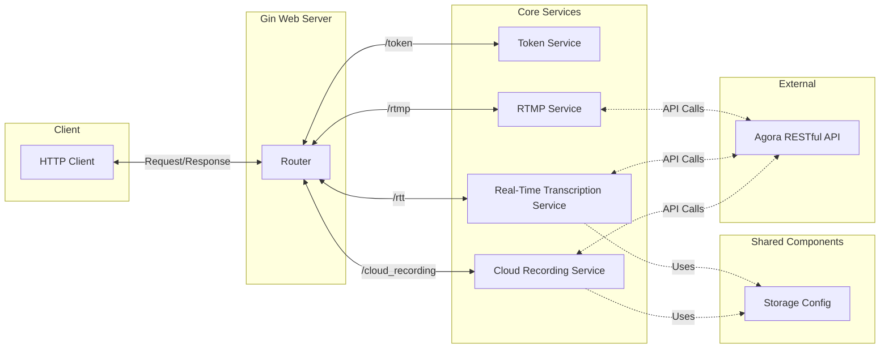

# Overview Flow Diagram

```mermaid
flowchart LR
    subgraph Client
        A[HTTP Client]
    end

    subgraph "Gin Web Server"
        B[Router]
    end

    subgraph "Core Services"
        direction TB
        C[Token Service]
        D[Cloud Recording Service]
        E[Real-Time Transcription Service]
        L[RTMP Service]
    end

    subgraph "Shared Components"
        J[Storage Config]
    end

    subgraph "External"
        K[Agora RESTful API]
    end

    A <-->|Request/Response| B
    B <-->|/token| C
    B <-->|/cloud_recording| D
    B <-->|/rtt| E
    B <-->|/rtmp| L

    D & E & L <-.->|API Calls| K
    D & E -.->|Uses| J
    classDef request fill:#f9f,stroke:#333,stroke-width:2px;
    classDef response fill:#bbf,stroke:#333,stroke-width:2px;
```
