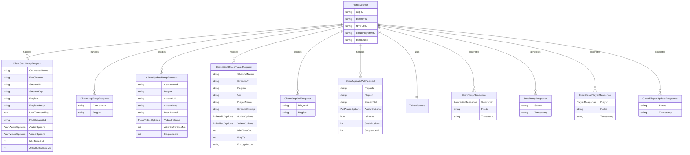

# RTMP Entity Relationship Diagram

```mermaid
erDiagram
    RtmpService ||--o{ ClientStartRtmpRequest : handles
    RtmpService ||--o{ ClientStopRtmpRequest : handles
    RtmpService ||--o{ ClientUpdateRtmpRequest : handles
    RtmpService ||--o{ ClientStartCloudPlayerRequest : handles
    RtmpService ||--o{ ClientStopPullRequest : handles
    RtmpService ||--o{ ClientUpdatePullRequest : handles
    RtmpService {
        string appID
        string baseURL
        string rtmpURL
        string cloudPlayerURL
        string basicAuth
    }

    RtmpService ||--|| TokenService : uses

    ClientStartRtmpRequest {
        string ConverterName
        string RtcChannel
        string StreamUrl
        string StreamKey
        string Region
        string RegionHintIp
        bool UseTranscoding
        string RtcStreamUid
        PushAudioOptions AudioOptions
        PushVideoOptions VideoOptions
        int IdleTimeOut
        int JitterBufferSizeMs
    }

    ClientStopRtmpRequest {
        string ConverterId
        string Region
    }

    ClientUpdateRtmpRequest {
        string ConverterId
        string Region
        string StreamUrl
        string StreamKey
        string RtcChannel
        PushVideoOptions VideoOptions
        int JitterBufferSizeMs
        int SequenceId
    }

    ClientStartCloudPlayerRequest {
        string ChannelName
        string StreamUrl
        string Region
        string Uid
        string PlayerName
        string StreamOriginIp
        PullAudioOptions AudioOptions
        PullVideoOptions VideoOptions
        int IdleTimeOut
        int PlayTs
        string EncryptMode
    }

    ClientStopPullRequest {
        string PlayerId
        string Region
    }

    ClientUpdatePullRequest {
        string PlayerId
        string Region
        string StreamUrl
        PullAudioOptions AudioOptions
        bool IsPause
        int SeekPosition
        int SequenceId
    }

    RtmpService ||--o{ StartRtmpResponse : generates
    StartRtmpResponse {
        ConverterResponse Converter
        string Fields
        string Timestamp
    }

    RtmpService ||--o{ StopRtmpResponse : generates
    StopRtmpResponse {
        string Status
        string Timestamp
    }

    RtmpService ||--o{ StartCloudPlayerResponse : generates
    StartCloudPlayerResponse {
        PlayerResponse Player
        string Fields
        string Timestamp
    }

    RtmpService ||--o{ CloudPlayerUpdateResponse : generates
    CloudPlayerUpdateResponse {
        string Status
        string Timestamp
    }
```
