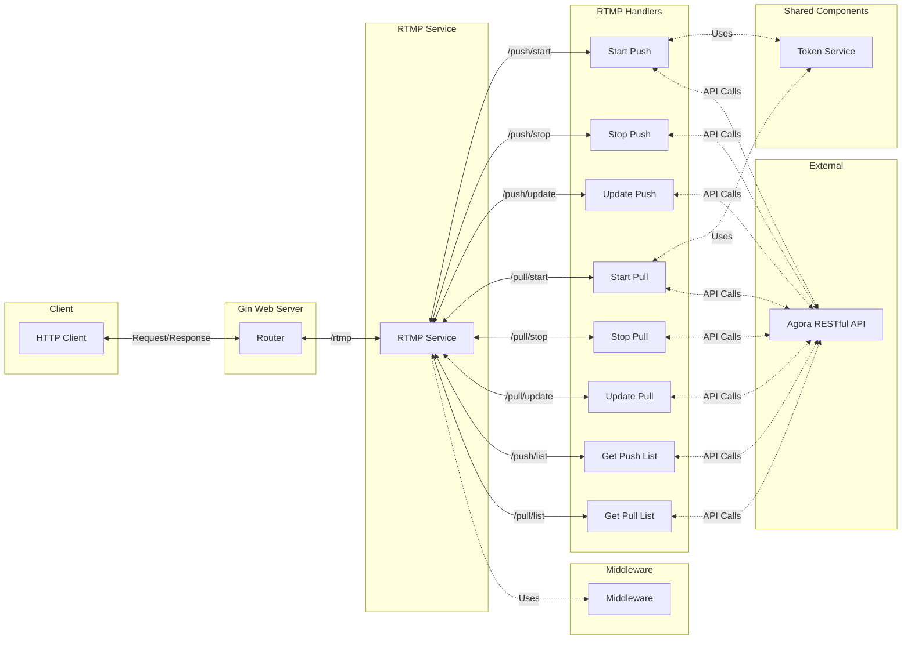

# RTMP Service Flow Diagram

```mermaid
flowchart LR
    subgraph Client
        A[HTTP Client]
    end

    subgraph "Gin Web Server"
        B[Router]
    end

    subgraph "RTMP Service"
        E[RTMP Service]
    end

    subgraph "RTMP Handlers"
        H1[Start Push]
        H2[Stop Push]
        H3[Update Push]
        H4[Start Pull]
        H5[Stop Pull]
        H6[Update Pull]
        H7[Get Push List]
        H8[Get Pull List]
    end

    subgraph "Shared Components"
        T[Token Service]
    end

    subgraph "Middleware"
        I[Middleware]
    end

    subgraph "External"
        K[Agora RESTful API]
    end

    A <-->|Request/Response| B
    B <-->|/rtmp| E
    E <-->|/push/start| H1
    E <-->|/push/stop| H2
    E <-->|/push/update| H3
    E <-->|/pull/start| H4
    E <-->|/pull/stop| H5
    E <-->|/pull/update| H6
    E <-->|/push/list| H7
    E <-->|/pull/list| H8
    H1 & H4 <-.->|Uses| T
    E -.->|Uses| I
    H1 & H2 & H3 & H4 & H5 & H6 & H7 & H8 <-.->|API Calls| K

    classDef request fill:#f9f,stroke:#333,stroke-width:2px;
    classDef response fill:#bbf,stroke:#333,stroke-width:2px;
```
