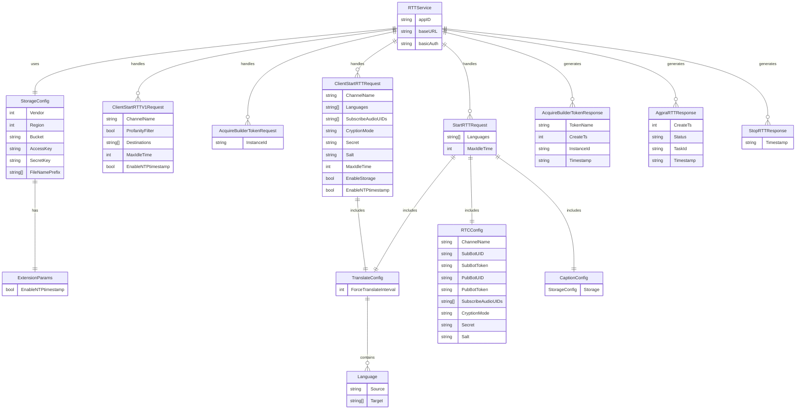

# Real Time Transcription Entity Relationship Diagram

```mermaid
erDiagram
    RTTService ||--o{ ClientStartRTTRequest : handles
    RTTService ||--o{ ClientStartRTTV1Request : handles
    RTTService ||--o{ AcquireBuilderTokenRequest : handles
    RTTService ||--o{ StartRTTRequest : handles
    RTTService {
        string appID
        string baseURL
        string basicAuth
    }

    RTTService ||--|| StorageConfig : uses
    StorageConfig {
        int Vendor
        int Region
        string Bucket
        string AccessKey
        string SecretKey
        string[] FileNamePrefix
    }
    StorageConfig ||--|| ExtensionParams : has
    ExtensionParams {
        bool EnableNTPtimestamp
    }

    ClientStartRTTRequest {
        string ChannelName
        string[] Languages
        string[] SubscribeAudioUIDs
        string CryptionMode
        string Secret
        string Salt
        int MaxIdleTime
        bool EnableStorage
        bool EnableNTPtimestamp
    }
    ClientStartRTTRequest ||--|| TranslateConfig : includes

    ClientStartRTTV1Request {
        string ChannelName
        bool ProfanityFilter
        string[] Destinations
        int MaxIdleTime
        bool EnableNTPtimestamp
    }

    AcquireBuilderTokenRequest {
        string InstanceId
    }

    StartRTTRequest {
        string[] Languages
        int MaxIdleTime
    }
    StartRTTRequest ||--|| RTCConfig : includes
    StartRTTRequest ||--|| CaptionConfig : includes
    StartRTTRequest ||--|| TranslateConfig : includes

    RTCConfig {
        string ChannelName
        string SubBotUID
        string SubBotToken
        string PubBotUID
        string PubBotToken
        string[] SubscribeAudioUIDs
        string CryptionMode
        string Secret
        string Salt
    }

    CaptionConfig {
        StorageConfig Storage
    }

    TranslateConfig {
        int ForceTranslateInterval
    }
    TranslateConfig ||--o{ Language : contains
    Language {
        string Source
        string[] Target
    }

    RTTService ||--o{ AcquireBuilderTokenResponse : generates
    AcquireBuilderTokenResponse {
        string TokenName
        int CreateTs
        string InstanceId
        string Timestamp
    }

    RTTService ||--o{ AgpraRTTResponse : generates
    AgpraRTTResponse {
        int CreateTs
        string Status
        string TaskId
        string Timestamp
    }

    RTTService ||--o{ StopRTTResponse : generates
    StopRTTResponse {
        string Timestamp
    }
```
