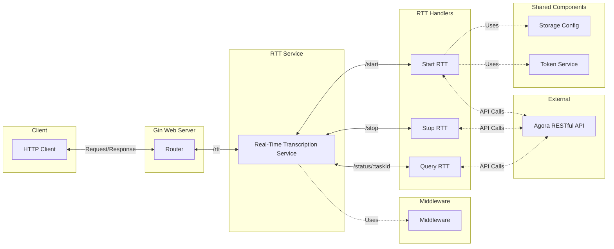

# Real Time Transcription (RTT) Flow Diagram

```mermaid
flowchart LR
    subgraph Client
        A[HTTP Client]
    end

    subgraph "Gin Web Server"
        B[Router]
    end

    subgraph "RTT Service"
        E[Real-Time Transcription Service]
    end

    subgraph "RTT Handlers"
        H1[Start RTT]
        H2[Stop RTT]
        H3[Query RTT]
    end

    subgraph "Shared Components"
        J[Storage Config]
        T[Token Service]
    end

    subgraph "Middleware"
        I[Middleware]
    end

    subgraph "External"
        K[Agora RESTful API]
    end

    A <-->|Request/Response| B
    B <-->|/rtt| E
    E <-->|/start| H1
    E <-->|/stop| H2
    E <-->|/status/:taskId| H3
    H1 -.->|Uses| J
    H1 -.->|Uses| T
    E -.->|Uses| I
    H1 & H2 & H3 <-.->|API Calls| K

    classDef request fill:#f9f,stroke:#333,stroke-width:2px;
    classDef response fill:#bbf,stroke:#333,stroke-width:2px;
```
