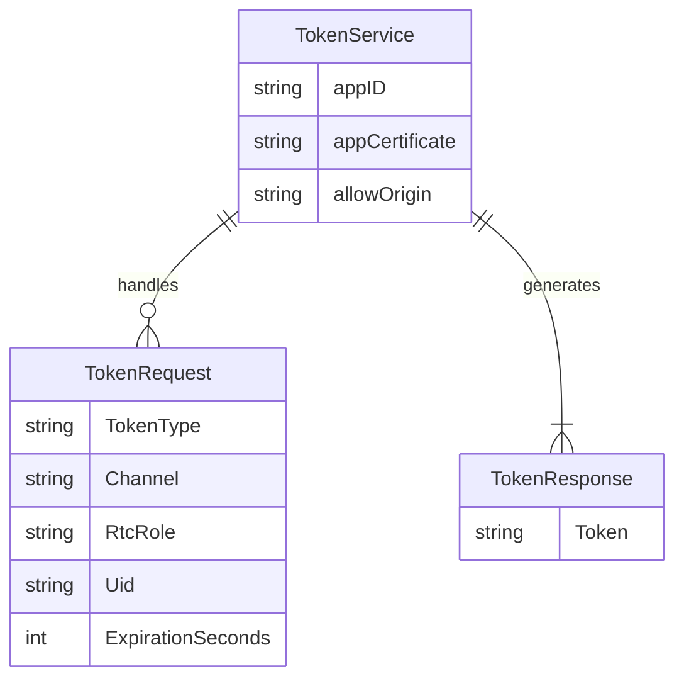

# Token Entity Relationship Diagram

```mermaid
erDiagram
    TokenService ||--o{ TokenRequest : handles
    TokenService {
        string appID
        string appCertificate
        string allowOrigin
    }
    TokenRequest {
        string TokenType
        string Channel
        string RtcRole
        string Uid
        int ExpirationSeconds
    }
    TokenService ||--|{ TokenResponse : generates
    TokenResponse {
        string Token
    }
```
