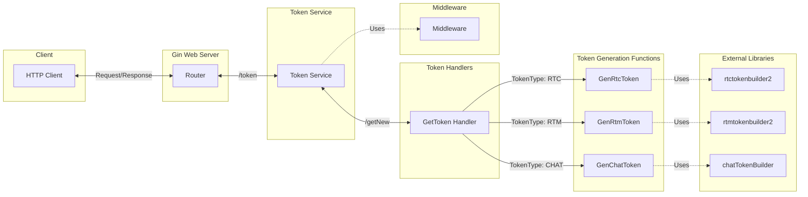

# Token Service Flow Diagram

```mermaid
flowchart LR
    subgraph Client
        A[HTTP Client]
    end

    subgraph "Gin Web Server"
        B[Router]
    end

    subgraph "Token Service"
        C[Token Service]
    end

    subgraph "Token Handlers"
        F1[GetToken Handler]
    end

    subgraph "Token Generation Functions"
        G1[GenRtcToken]
        G2[GenRtmToken]
        G3[GenChatToken]
    end

    subgraph "External Libraries"
        E1[rtctokenbuilder2]
        E2[rtmtokenbuilder2]
        E3[chatTokenBuilder]
    end

    subgraph "Middleware"
        I[Middleware]
    end

    A <-->|Request/Response| B
    B <-->|/token| C
    C <--> |/getNew| F1
    F1 -->|TokenType: RTC | G1
    F1 -->|TokenType: RTM | G2
    F1 -->|TokenType: CHAT | G3
    G1 -.->|Uses| E1
    G2 -.->|Uses| E2
    G3 -.->|Uses| E3
    C -.->|Uses| I

    classDef request fill:#f9f,stroke:#333,stroke-width:2px;
    classDef response fill:#bbf,stroke:#333,stroke-width:2px;
```
