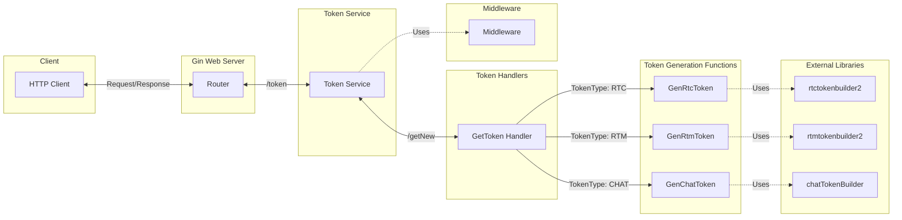
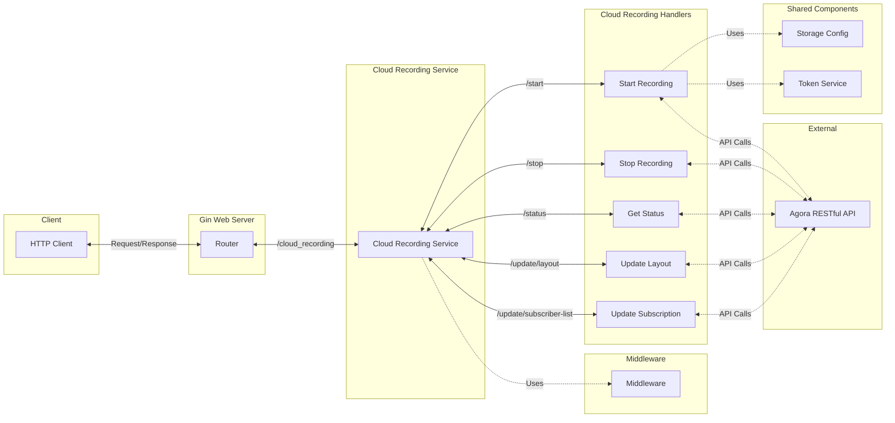
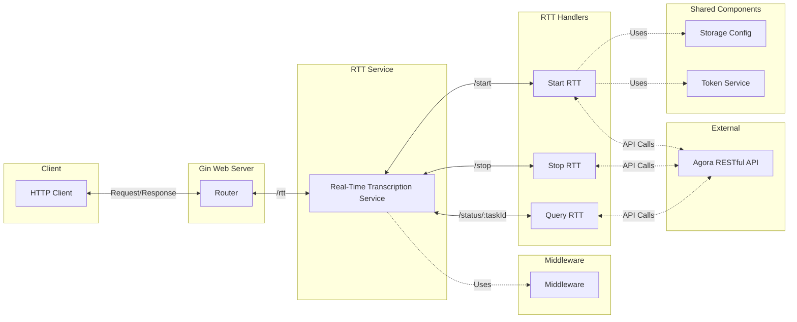
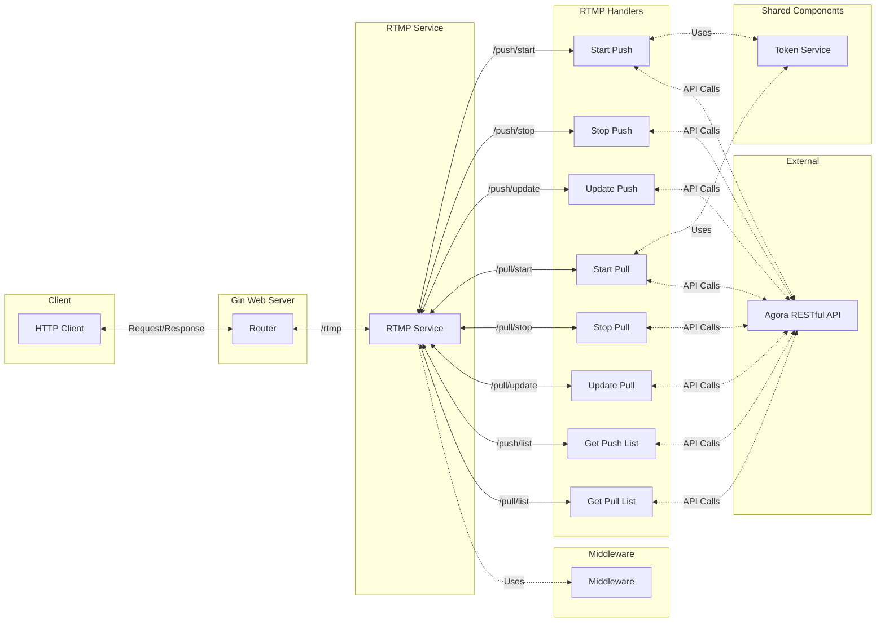

# Get Started with the Agora Middleware Service

The Agora Middleware Service is a Go-based backend solution that simplifies integrating Agora's cloud services into your applications. It provides a set of RESTful APIs for token generation, cloud recording management, and real-time transcription. 
The Agora Middleware Service serves two primary purposes:

1. For front-end developers: It provides a ready-to-use backend that handles Agora API interactions, allowing you to focus on building your application's user interface and features.

2. For backend developers: It offers a quick deployment option to support front-end teams working with Agora SDKs, reducing the time and effort needed to set up a custom backend.

Key features of the middleware service include:

- Token generation for RTC, RTM, and Chat services
- Cloud recording management (start, stop, update layout, etc.)
- Real-time transcription control
- RTMP push and pull services
- Configurable storage options for recordings and transcriptions
- Easy-to-use RESTful API endpoints

Let's dive into setting up and using this powerful tool!

## Table of Contents

1. [Prerequisites](#prerequisites)
1. [Installation](#installation)
1. [Configuration](#configuration)
1. [Running the Service](#running-the-service)
1. [API Overview](#api-overview)
   - [Token Generation](#token-generation)
   - [Cloud Recording](#cloud-recording)
   - [Real-Time Transcription](#real-time-transcription)
   - [RTMP Service](#rtmp-service)
1. [Testing the APIs](#testing-the-apis)
1. [Best Practices](#best-practices)
1. [Troubleshooting](#troubleshooting)
1. [Support](#support)

## Prerequisites

Before you begin, make sure you have the following:

1. Go (version 1.16 or later) installed on your system
1. An Agora developer account (if you don't have one, sign up at [https://www.agora.io/](https://www.agora.io/))
1. Your Agora App ID and App Certificate
1. Your Agora Customer ID and Customer Secret
1. A cloud storage provider: Amazon S3, Alibaba Cloud, Tencent Cloud, Microsoft Azure, Google Cloud, Huawei Cloud, Baidu IntelligentCloud
1. Basic knowledge of RESTful APIs and JSON
1. (Optional) A tool for making HTTP requests, such as Bruno or Postman. You can also use cURL.

## Installation

To get started with the Agora Middleware Service, follow these steps:

1. Clone the repository:

   ```
   git clone https://github.com/AgoraIO-Community/agora-go-backend-middleware.git
   ```

2. Navigate to the project directory:

   ```
   cd agora-go-backend-middleware
   ```

3. Install the required dependencies:
   ```
   go mod download
   ```

## Configuration

Proper configuration is crucial for the middleware service to function correctly. Follow these steps to set up your environment:

1. Copy the example environment file:

   ```
   cp .env.example .env
   ```

2. Open the `.env` file in your favorite text editor and fill in the required values:

   ```
   APP_ID=your_agora_app_id
   APP_CERTIFICATE=your_agora_app_certificate
   CUSTOMER_ID=your_customer_id
   CUSTOMER_SECRET=your_customer_secret
   CORS_ALLOW_ORIGIN=*
   SERVER_PORT=8080
   AGORA_BASE_URL=https://api.agora.io/
   AGORA_CLOUD_RECORDING_URL=v1/apps/{appId}/cloud_recording
   AGORA_RTT_URL=v1/projects/{appId}/rtsc/speech-to-text
   AGORA_RTMP_URL=v1/projects/{appId}/rtmp-converters
   AGORA_CLOUD_PLAYER_URL=v1/projects/{appId}/cloud-player
   STORAGE_VENDOR=
   STORAGE_REGION=
   STORAGE_BUCKET=
   STORAGE_BUCKET_ACCESS_KEY=
   STORAGE_BUCKET_SECRET_KEY=
   ```

   Make sure to replace the placeholder values with your actual Agora credentials and desired configuration options.

3. If you're using cloud storage for recordings or transcriptions, fill in the appropriate storage configuration values.

## Running the Service

Now that you've configured the service, it's time to run it. We have a few options:

1. Using Go:

   ```bash
   go run cmd/main.go
   ```

2. Using Docker and Make:

   ```bash
   make build
   make run
   ```

If everything is set up correctly, you should see output indicating that the server is running on `http://localhost:8080` (unless you've specified a different port in the `.env` file).

## API Overview

The middleware service exposes Agora APIs for: Token Generation, Cloud Recording, Real-Time Transcription, and RTMP (Push & Pull). Let's explore each set of endpoints and how to use them.

### Token Generation

---

The Token Generation API allows you to create tokens for Agora services. These tokens are essential for authenticating users and maintaining the security of your application.

Endpoint: `POST /token/getNew`

You can generate tokens for:

- RTC (Real-Time Communication)
- RTM (Real-Time Messaging)
- Chat



### Cloud Recording

---

The Cloud Recording API provides endpoints for managing cloud recording sessions. This includes starting and stopping recordings, updating layouts, and managing recording resources.

Key endpoints:

- Start Recording: `POST /cloud_recording/start`
- Stop Recording: `POST /cloud_recording/stop`
- Get Recording Status: `GET /cloud_recording/status`
- Update Layout: `POST /cloud_recording/update/layout`



### Real-Time Transcription

---

The Real-Time Transcription (RTT) API allows you to control transcription sessions, enabling you to convert speech to text in real-time during your Agora calls.

Key endpoints:

- Start RTT: `POST /rtt/start`
- Stop RTT: `POST /rtt/stop/:taskId`
- Query RTT Status: `GET /rtt/status/:taskId`



### RTMP Service

---

The RTMP (Real-Time Messaging Protocol) Service provides APIs for managing RTMP push and pull operations. This allows you to stream media to RTMP destinations or pull RTMP streams into Agora channels.

<div style="display: flex; justify-content: space-between;">
  <div style="width: 48%;">
    <h4>RTMP Push (RTMP Converter)</h4>
    <p>RTMP Push, also known as RTMP converter enables you to stream content from an Agora channel to an RTMP destination.</p>
    <p>Key endpoints:</p>
    <ul>
      <li>Start Push: <code>POST /rtmp/push/start</code></li>
      <li>Stop Push: <code>POST /rtmp/push/stop</code></li>
      <li>Update Push: <code>POST /rtmp/push/update</code></li>
      <li>List Push: <code>GET /rtmp/push/list</code></li>
    </ul>
  </div>
  <div style="width: 48%;">
    <h4>RTMP Pull (Cloud Player)</h4>
    <p>RTMP Pull, also known as Cloud Player, allows you to pull RTMP streams into an Agora channel.</p>
    <p>Key endpoints:</p>
    <ul>
      <li>Start Pull: <code>POST /rtmp/pull/start</code></li>
      <li>Stop Pull: <code>POST /rtmp/pull/stop</code></li>
      <li>Update Pull: <code>POST /rtmp/pull/update</code></li>
      <li>List Pull: <code>GET /rtmp/pull/list</code></li>
    </ul>
  </div>
</div>



Both RTMP Push and Pull services support various configuration options for audio and video, allowing fine-tuned control over the streaming process. Remember to handle the responses appropriately in your application to manage the RTMP sessions effectively.

## Testing the APIs

To ensure your middleware service is working correctly, you can test the APIs using tools like cURL, Bruno or Postman. We've prepared comprehensive set of examples for each service.

- Bruno: [agora-backend-middleware.bru](./bruno/agora-backend-middleware.bru)
- Postman: [Agora Backend Middleware.postman_collection](./postman/AgoraBackendMiddleware.postman_collection.json).
- cURL example requests:

  1. [Token Service](./Local_Testing/Token_curl.md)
  1. [Cloud Recording](./Local_Testing/Cloud_Recording_curl.md)
  1. [Real-Time Transcription](./Local_Testing/Real_Time_Transcription_curl.md)
  1. [RTMP Service](./Local_Testing/RTMP_curl.md)

> Remember to replace `localhost:8080` with the appropriate address if your service is running on a different host or port. Also, make sure to update any placeholder values (like channel names, UIDs, etc.) with real values that match your testing environment.

## Best Practices

To make the most of the Agora Middleware Service, consider the following best practices:

1. **Security**: Always use HTTPS in production environments to encrypt data in transit.
1. **Error Handling**: Implement proper error handling in your client applications to gracefully manage API responses.
1. **Rate Limiting**: Be mindful of Agora's API rate limits and implement appropriate throttling mechanisms if necessary.
1. **Logging**: Enable and monitor logs to track usage and troubleshoot issues.
1. **Regular Updates**: Keep the middleware service updated to benefit from the latest features and security improvements.

## Troubleshooting

If you encounter issues while using the middleware service, try the following:

1. Double-check your `.env` configuration to ensure all values are correct.
1. Verify that your Agora account is active and your project has the necessary services enabled.
1. Check the console output for any error messages or logs.
1. Ensure your firewall or network settings are not blocking the service.
1. Verify that the required ports are open and accessible.

## Support

If you need further assistance or have questions about the Agora Middleware Service, you have several options:

1. Visit the [official Agora documentation](https://docs.agora.io/) for detailed information about Agora's services and for additional resources.
1. Open an issue on the [GitHub repository](https://github.com/AgoraIO-Community/agora-go-backend-middleware) if you believe you've found a bug or have a feature request.

Remember, the Agora team is here to help you (our community) succeed in building amazing real-time communication applications!

With this guide, you should now have a solid understanding of how to set up, configure, and use the Agora Middleware Service. Happy coding, and we can't wait to see what you'll build with Agora!
