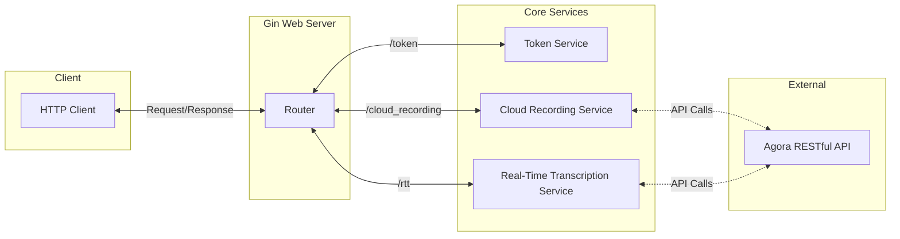

# Agora Go Backend Middleware &nbsp;&nbsp;

The Agora Go Backend Middleware is a microservice that exposes a RESTful API designed to simplify interactions with [Agora.io](https://www.agora.io). Written in Golang and powered by the [Gin framework](https://github.com/gin-gonic/gin), this project serves as a middleware to bridge front-end applications using Agora's Real-Time Voice or Video SDKs with Agora's RESTful APIs.

This middleware streamlines the activation of Agora's extension services, such as Cloud Recording, Real-Time Transcription, and Media Services. To enhance security, the project includes a built-in Token Server with public endpoints, based on the [AgoraIO Community Token Service](https://github.com/AgoraIO-Community/agora-token-service/), ensuring seamless token generation for services requiring Token Security.

## How to Run

Create a `.env` and set the environment variables.

```bash
cp .env.example .env
```

```bash
go run cmd/main.go
```

### Health Check

- GET `/ping`
  - Response: `{"message": "pong"}`

## Micro-Services & Endpoints



For detailed API specifications, and curl command examples to test the API endpoints locally, please refer to the following pages:

### Token Service

`TokenService` holds the necessary configurations and dependencies for managing tokens.

- [Flow](./DOCS/Architectures/Token_Flow.md)
- [Entity Relationships](./DOCS/Architectures/Token_Entity.md)
- [Endpoints](./DOCS/Endpoints/Token.md)
- [Curl Examples](./DOCS/Local_Testing/Token.md)

### Cloud Recording

`CloudRecordingService` holds the necessary configurations and dependencies for managing cloud recording requests. This includes Cloud Storage for RTT Service

- [Flow](./DOCS/Architectures/Cloud_Recording_Flow.md)
- [Entity Relationships](./DOCS/Architectures/Cloud_Recording_Entity.md)
- [Endpoints](./DOCS/Endpoints/Cloud_Recording.md)
- [Curl Examples](./DOCS/Local_Testing/Cloud_Recording.md)

### Real Time Transcription (RTT)

`RTTService` holds all the necessary configurations and dependencies required for managing real-time transcription requests.

- [Flow](./DOCS/Architectures/Real_Time_Transcription_Flow.md)
- [Entity Relationships](./DOCS/Architectures/Real_Time_Transcription_Entity.md)
- [Endpoints](./DOCS/Endpoints/Real_Time_Transcription.md)
- [Curl Examples](./DOCS/Local_Testing/Real_Time_Transcription.md)
